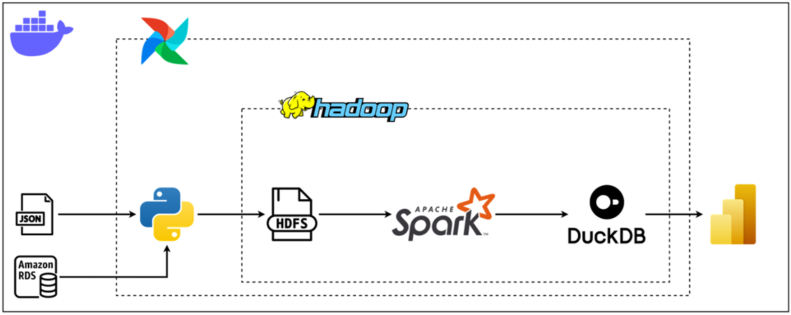
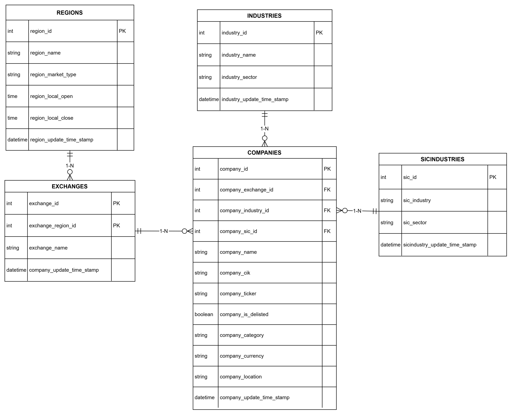
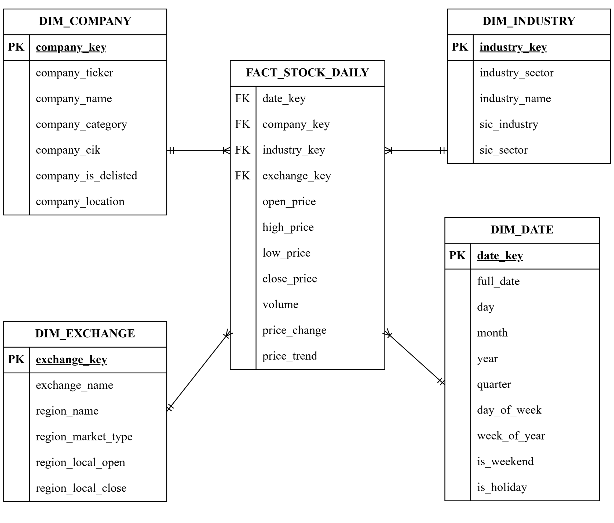

# Stock-ELT

A pipeline that automatically collects, stores, and processes stock market data (NYSE, NASDAQ) into a Data Warehouse built as a Star Schema, ready for analysis and visualization for BI.

---

## Introduction

### Goals:

- Build a **Data Warehouse** that stores daily stock price data (OHLC) for companies listed on NYSE and NASDAQ, along with company info, industry, and exchange details.
- Automate the whole data lifecycle with no manual steps needed.
- Model the data as a **Star Schema** to make analytical (OLAP) queries.

### Tech stack:

<p align="center">
  
</p>

### APIs:

| API                                                                        | Used for                 | Crawl frequency |
| -------------------------------------------------------------------------- | ------------------------ | --------------- |
| [SEC-API](https://sec-api.io/)                                             | List of listed companies | Monthly         |
| [Alpha Vantage](https://www.alphavantage.co/)                              | Exchange and region      | Monthly         |
| [Massive API](https://massive.com/docs/rest/stocks/aggregates/custom-bars) | Daily OHLC data          | Daily           |

---

## Diagrams

**Data source**: Builds and updates the source database on MySQL, acting as the OLTP layer normalized to 3NF. Data comes from [SEC-API](https://sec-api.io/) and [Alpha Vantage](https://www.alphavantage.co/).

<p align="center">
  
</p>

**ELT**: Fetches the latest stock price data, re-syncs metadata from MySQL, processes it with Spark, and loads the result into the DuckDB Data Warehouse. Data comes from the source database and [Massive API](https://massive.com/docs/rest/stocks/aggregates/custom-bars).

<p align="center">
  
</p>

## Dashboard

The visualization report is built in Power BI, with data pulled directly from the DuckDB Data Warehouse:

- Power BI file: [`dashboard.pbix`](dashboard/dashboard.pbix)
- PDF: [`dashboard.pdf`](dashboard/dashboard.pdf)

---

## Setup

### Initial:

```bash
git clone https://github.com/Avcuongy/stock-elt.git

cd stock-elt

python -m venv .venv

.venv\Scripts\Activate.ps1

pip install -r requirements.txt

pip install -e .
```

### Run:

```bash
# Config
python scripts/config.py

# Docker
docker-compose up -d --build

docker exec -it hadoop-namenode hdfs dfs -mkdir -p /data_lake

docker exec -it hadoop-namenode hdfs dfs -chmod -R 777 /data_lake
```

Access:

- Airflow UI: http://localhost:8080
- Hadoop UI: http://localhost:9870

### Scripts:

> Use this for testing or point to src/.

```
# Data source
python scripts/backend/extract.py
python scripts/backend/transform.py
python scripts/backend/load.py

# ETL
python scripts/elt/extract.py
python scripts/elt/load.py
python scripts/elt/transform.py
```
